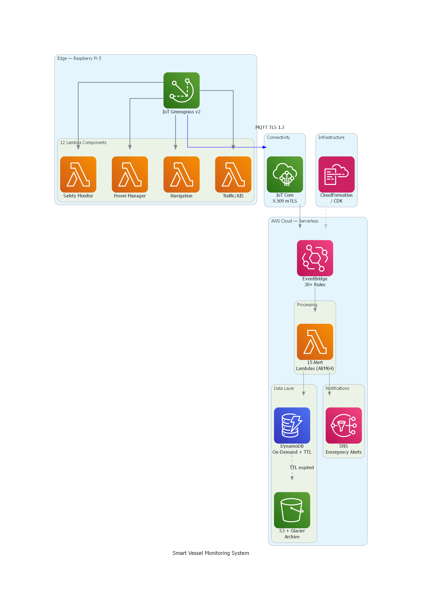
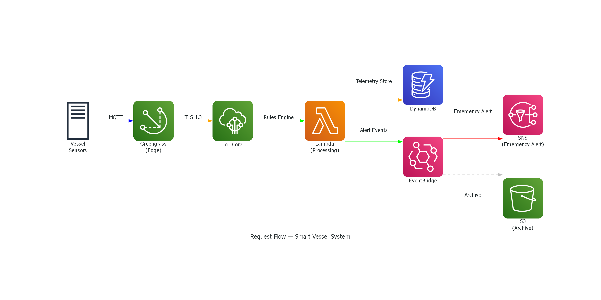
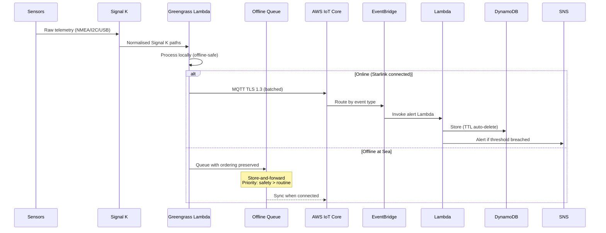

# ⛵ Smart Vessel Monitoring & Automation System

> Principal Architect | Industrial IoT & Edge AI PlatformArchitected an enterprise-grade, offline-first Edge IoT platform for maritime fleets, featuring real-time data fusion, predictive analytics, and zero-trust security.Edge Compute: Deployed an offline-first architecture using AWS IoT Greengrass v2 and ARM64 Lambda for disconnected environments.Data Fusion: Engineered a high-throughput pipeline correlating streaming data (AIS, radar, vision, GPS) for real-time hazard mitigation.Predictive ML: Implemented FFT vibration analysis and ML baseline detection to automate component degradation trending.Formal Testing: Validated system correctness with property-based testing (fast-check) across complex event-driven models.Zero-Trust Security: Enforced strict data governance via X.509 mTLS, TLS 1.3, and automated alert sanitisation.Cost Engineering: Hyper-optimized the serverless stack using MQTT batching, capping operational costs under £2/month.

[]()
[]()
[]()
[]()
[]()

🌐 **[Live Demo →](https://stevenowenaws.com/demo.html)** (right-click map to plan a passage)

---

## 🎯 What This Project Demonstrates

| Skill Area | Implementation |
|-----------|---------------|
| **AWS IoT & Edge Computing** | IoT Core (X.509 mTLS), Greengrass v2, offline-first Lambda components |
| **Serverless Architecture** | Lambda (ARM64), DynamoDB, EventBridge, SNS, S3, CloudFormation |
| **Event-Driven Design** | Signal K data bus → local pub/sub → MQTT → EventBridge routing |
| **Property-Based Testing** | 24 formal correctness properties validated with fast-check (100+ iterations each) |
| **Security by Design** | Zero-trust position privacy, TLS 1.3, IAM least-privilege, alert sanitisation |
| **Real-Time Data Fusion** | AIS + radar + vision + GPS correlation for collision avoidance |
| **Predictive Analytics** | FFT vibration analysis, degradation trending, ML baseline detection |
| **Cost Engineering** | Full AWS stack under £2/month using Free Tier + ARM64 + MQTT batching |
| **AI-Driven Decision Making** | Consumables AI recommends shore visits based on multi-variable optimisation |

---

## 🏗️ System Architecture



## 🔄 Request Flow



---

## 🔄 Data Flow: Sensor to Cloud



---

## 🛡️ Safety-Critical Design

| System | Response Time | Fail-Safe |
|--------|--------------|-----------|
| Pug ventilation | < 10 seconds | Fans full power on sensor timeout |
| Engine overheat | < 2 seconds | STOP ENGINE recommendation |
| Collision avoidance | < 2 seconds | Course alteration recommendation |
| Anchor drag | < 5 seconds | Audio alarm + cloud alert |
| Depth alarm | < 1 second | Visual + reduce speed |
| GPS failure | 30 seconds | Secondary → dead reckoning |
| Load shedding | Immediate | Priority-ordered, never sheds safety circuits |

---

## 📊 Test Coverage

| Category | Tests | Approach |
|----------|-------|----------|
| Unit tests | 1,400+ | Vitest — all subsystems |
| Property-based tests | 24 properties × 100+ iterations | fast-check formal invariants |
| Integration tests | 22 | End-to-end data flow validation |
| **Total** | **1,633 passing** | **Zero failures** |

### Key Properties Verified

- Engine alerts always fire within 2 seconds of threshold breach
- Pug fans always reach full power within 10 seconds of 32°C
- Priority 1 circuits are never load-shed regardless of battery SOC
- Vessel is never recommended a marina it physically cannot enter
- Same-source telemetry messages are always processed in timestamp order
- CPA < 0.5nm + TCPA < 10min always triggers DANGER classification
- Position data is never present in any SNS alert message

---

## 🚀 Live Demo

**[stevenowenaws.com/demo.html](https://stevenowenaws.com/demo.html)**

The demo runs entirely in your browser (no server, £0 cost). It simulates:
- Vessel moving through The Wash with live engine/power/navigation telemetry
- 8 AIS vessels on real UK shipping lanes
- Safety alarms triggering on schedule (pug temp, shallow water, collision)
- **Right-click the map** to auto-plan a passage with fuel/water/rest stops

---

## 🏃 Quick Start

```bash
git clone https://github.com/Steven-Owen-21/smart-vessel-system.git
cd smart-vessel-system/greengrass-edge
npm install
npm test   # Run all 1,633 tests

# Run the local demo
cd ../demo
npm install
npm start  # Open http://localhost:3000
```

---

## 📁 Project Structure

```
smart-vessel-system/
├── greengrass-edge/              # Edge computing (Raspberry Pi 5)
│   ├── src/
│   │   ├── safety/              # Pug ventilation, sensor failure handling
│   │   ├── power/               # Load shedding, power budget
│   │   ├── circuits/            # Per-circuit monitoring, Sankey data
│   │   ├── engine/              # Diagnostics, FFT, predictive maintenance
│   │   ├── navigation/          # GPS, depth, anchor watch, route planning
│   │   ├── traffic/             # AIS, radar, CPA/TCPA, COLREGS, TSS
│   │   ├── weather/             # GRIB processing, storm detection
│   │   ├── autopilot/           # Multi-mode control, VMG optimisation
│   │   ├── resources/           # Tank levels, provisions, watermaker
│   │   ├── intelligence/        # Marina finder, consumables AI
│   │   ├── surveillance/        # Camera system, NVR, motion detection
│   │   ├── vision/              # Coral TPU YOLOv8 pipeline
│   │   ├── display/             # Tablet data serving, Sankey diagrams
│   │   ├── security/            # Position stripping, config validation
│   │   ├── recovery/            # Disaster recovery, failover
│   │   ├── telemetry/           # Ordering, monotonicity enforcement
│   │   └── wiring/              # Signal K → component subscriptions
│   └── tests/
│       ├── unit/                # 45 test files
│       ├── properties/          # 25 property-based test files
│       └── integration/         # End-to-end flow tests
├── aws-cloud/                   # AWS serverless backend
│   ├── iot-core/                # IoT Core config + CloudFormation
│   ├── lambdas/                 # 15 alert handlers + marina sync
│   ├── pipeline/                # EventBridge wiring + topic mapping
│   └── cost-optimisation/       # Budget validation + compliance
├── signalk-server/              # Signal K server configuration
├── demo/                        # Live demo dashboard
│   ├── public/index-static.html # Self-contained browser demo
│   ├── server.mjs              # Local WebSocket server
│   └── simulator.mjs           # Vessel telemetry simulator
└── docs/                        # Architecture diagrams
```

---

## 💡 Design Decisions

| Decision | Rationale |
|----------|-----------|
| **Offline-first** | Vessel must function safely without internet |
| **Signal K as data bus** | Open marine standard, single source of truth |
| **Property-based testing** | Formal verification of safety invariants |
| **ARM64 Graviton** | 20% cheaper, 40% more efficient Lambda |
| **MQTT batching** | 100x reduction in IoT Core messages |
| **Position never in alerts** | Zero-trust privacy by design |
| **Dual Pi with air-gap** | Lightning on primary doesn't kill secondary |
| **< £2/month cloud** | Demonstrates cost-conscious architecture |

---

## 🛠️ Tech Stack

**Edge:** Node.js 20 (ESM) · Vitest · fast-check · Signal K · AWS IoT Greengrass v2 · Coral TPU · SQLite

**Cloud:** AWS IoT Core · EventBridge · Lambda (ARM64) · DynamoDB · S3/Glacier · SNS · CloudFormation

**Demo:** Leaflet.js · Open-Meteo API · Chart.js · Static S3/CloudFront hosting

---

## 📄 License

MIT

---

*Built to demonstrate that complex multi-system integration problems can be solved elegantly — with the right architecture, formal verification, and a budget of nearly zero.*
